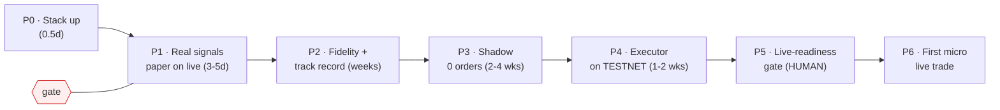

# Valor → First Live Trade — Roadmap

A sequential, gated path. **Each phase has a go/no-go gate; you may not start a phase
until the prior gate is green.** No real money skips a rung. Phases 5–6 require
explicit human authorization (real API keys / real capital).

Legend: ✅ done · ⬜ todo · 🔒 human-authorization gate

---

## You are here
**Gates 0 & 1 ✅ CLOSED.** Phase-2 honest backtest + OOS search built and run. **Verdict: no
out-of-sample edge in the naive daily pair-z-score** (TRAIN +44% → VALID +1.9%, overfit). The
infra, safety, optimizer, and OOS gate are all proven — the open problem is now **ALPHA** (a
research endeavor), not engineering. The machine is ready to test ideas rigorously + safely.
**Next: signal research (intraday, cointegration/ADF tests, funding-aware, more pairs) →
re-run `oos_search.py` until something survives OOS; only then does advancing toward live make sense.**

---

## Phase 0 — Stand up the full stack  ·  ~0.5 day
Goal: the whole loop runs locally, not just the core.
- ✅ **Real `/ingest` path verified** (FastAPI + pydantic → `loop.run_inner` → core): 5 signals
  ingested, `/kpis` honest, bad `risk_score` → HTTP 422, ledger wrote 5 rows. *(2026-06-23,
  py3.9 + fastapi/pydantic/uvicorn subset.)*
- ✅ `/health` + `/kpis` OK
- ⬜ Full `docker compose -f infra/docker-compose.yml up --build` (redis, postgres, mlflow,
  bot, dashboard, langgraph worker) — **needs a Docker + Python 3.11 host** (this dev box is
  3.9 / no Docker). ~5 min on your machine.
- ✅ **Telegram creds + outbound alerts verified** — bot `@Va10r_Bot`, admin chat set in
  `evolver/.env` (gitignored), test message delivered via the `notify.py` path. *(2026-06-23)*
- ⬜ Streamlit dashboard (:8501) renders — needs host
- ⬜ Interactive bot polling (`/status` `/approve` …) — needs the PTB process on the host
**GATE 0:** API → loop → ledger ✅ · Telegram creds + alerts ✅. Dashboard + interactive bot
polling pending a Docker/3.11 host (env task, not code).

## Phase 1 — Real signals, paper on live  ·  ~3–5 days
Goal: Valor's *live* signals drive the loop with the real analyst.
- ✅ **Enrich Valor** to emit real `zscore` / `spread_value` / `expected_convergence_hours`
  — engine computes them per type (real z + OU half-life for ratio/pair signals; normalized
  dislocation + per-type horizon for carry/cross-venue); nullable DB columns + migration 0003;
  bridge passes them through. **Verified live on OKX** (btc_eth z=1.33, ethSol z=−1.20, all
  signals enriched). 56 tests green. *(2026-06-23)*
- ✅ **Redis bus end-to-end** — `XADD valor.signals` → consumer → live gpt-5-mini → shared
  ledger, verified in the running Docker stack. (Valor still HTTP-forwards via `/ingest`;
  switching its emitter to `XADD` is a one-liner when wanted.) *(2026-06-23)*
- ✅ **LLM analyst live** — `run_inner` (FastAPI + Redis bus) and the graph node use the fast
  model (`gpt-5-mini`) via `build_fast_llm()` (temperature=1 for gpt-5.x, JSON mode), with a
  deterministic fallback. **Verified live**: all 5 sample signals → valid `TradeDecision`s,
  correct directions, neutral on defensive regimes. Caught + fixed a prompt enum bug
  (`"enter"`→`"long"`). Dep-light fallback verified. *(2026-06-23)*
- ✅ **Unified loop state** — shared file-backed store (ledger/signals/risk-state on the shared
  volume, atomic writes) so `/kpis`, the bot `/status`, and the dashboard read ONE book.
  **Verified cross-process** (a separate process sees the loop's trades + equity). Postgres
  with a single-writer row lock is the cloud upgrade (roadmap). *(2026-06-23)*
- ✅ **MLflow run-per-cycle wired** — params (action/regime/model/version) + metrics
  (pnl/equity/drawdown/sharpe) per signal; **fail-safe** (no-op without a tracking URI, all
  errors swallowed — verified). UI on :5001. **LangSmith** is env-only: set
  `LANGCHAIN_TRACING_V2=true` + `LANGCHAIN_API_KEY` in `.env` and LLM calls auto-trace. *(2026-06-23)*
**GATE 1:** ✅ **CLOSED** — bus → gpt-5-mini → unified KPIs across api/bot/dashboard, shared
kill switch, MLflow run-per-cycle (5 runs confirmed in UI). Only a passive multi-hour soak
remains before leaning on it.

## Phase 2 — Fidelity + track record  ·  ~2–4 days build, then WEEKS of accrual
Goal: a paper record you'd actually believe.
- ✅ **Backtest harness** — OKX-calibrated costs + `backfill_signals.py` (real OKX history →
  contract signals) + `backtest.py` (**forward-outcome** resolution vs real future prices).
  🚩 **Honest verdict (2026-06-23):** the naive daily pair-z-score is ≈ breakeven after fees
  (PF 1.01, Sharpe ~0, convergence 0.47, equity 100k→99.8k) — the fantasy heuristic replay
  claimed +671%. **No real edge yet; caught in free paper, not live.** → the real Phase-2
  work is optimizer OOS search + signal research until the *honest* backtest shows genuine
  out-of-sample edge.
- ⬜ Accumulate a meaningful sample: **≥200 closed paper trades across ≥2 regimes**
- ⬜ Outer loop (Optuna) fires; exercise the **full promotion path once** (proposal →
  `/approve` → versioned bump) on Telegram
**GATE 2:** over the sample — paper Sharpe (per-trade) positive + **stable out-of-sample**,
maxDD inside `max_dd_kill`, PF > 1.2. **Status (2026-06-23): NOT met** — `oos_search.py`
shows the best-tuned config overfits (TRAIN Sharpe 0.47 / +44% → VALID Sharpe 0.07 / +1.9%).
The OOS gate correctly refuses it. → Advancing toward live now needs **alpha**: a signal
family that passes the *honest* OOS backtest. The machine is built + proven and will evaluate +
(human-gated) deploy the moment a real edge appears. Tuning won't conjure it — research will.

**Update (2026-06-23) — hybrid data layer + first real lead.** Built a source-per-need data
router (`evolver/data/sources.py`): OKX (clean spot+perp) + Hyperliquid (hourly funding+premium)
+ Binance dumps (years of history via CDN), with fallback + lineage. On ~24mo of deep Binance
funding, **maker funding-carry** (collect when ann-funding >12%, ~7d hold, 2-leg maker) is the
first lead that survives an honest OOS test — **cross-asset validation holds** (fit 2 coins →
held-out coin Sharpe +1.1 / +3.6 / +2.1). ⚠️ Caveats: tiny samples (n≈5-6), **regime-dependent**
(idles when funding is calm — most of 2025-26), and **tail risk** (basis blowout on funding
flips) not yet quantified. Earns deeper validation — NOT yet a version or `/approve`.

**18-coin significance test (2026-06-23):** funding *collection* is broad + significant — 356
trades, **18/18 coins net positive, bootstrap p=0.000**, $16.8k collected. BUT `max_dd −0.1%`
and `PF 18.7` are physically impossible → the **daily-close model under-models risk** (basis
blowout, perp-leg liquidation, intraday funding flip, slippage are invisible). The carry edge
is real and broad; the Sharpe/DD are fantasy. **NOT promotable until intraday + liquidation +
slippage are modeled**, then re-run the significance test. (`scripts/funding_universe.py` now
self-flags implausible DD/PF.)

**Risk-modeled intraday verdict (2026-06-23) — KILLED.** With 1h basis + liquidation + slippage
modeled (`evolver/optimize/funding_intraday.py`, `scripts/funding_universe_intraday.py`), the
carry collapses: 706 trades / 14 coins → **Sharpe −0.30, win-rate 31%** (vs daily's 84%), PF
0.47, return −5.6%, realistic max_dd −5.9%, **worst intra-trade excursion −21%** (the basis
blowout daily hid), only **2/14 coins positive**. Naive funding carry LOSES money once risk is
honest — killed in paper, for free. **Basis-managed retest (stop-loss sweep) made it WORSE**
(1% stop → 9,626 whipsaw stop-outs → −100%); the basis is mean-reverting, so stops sell the
bottom. Carry is dead naive + risk-modeled + basis-managed. Thread closed.

**Cross-venue funding dislocation (2026-06-23) — FIRST REAL LEAD.** Binance-perp vs
Hyperliquid-perp funding differential, delta-/basis-neutral (both legs the same perp, so the
spot-perp blowup that killed carry can't happen — daily max_dd <1%). `evolver/optimize/
cross_venue.py` + `scripts/cross_venue_oos.py` (HL client now has 429 backoff; data cached to
`.xv_cache_*.pkl`). Differential is real & persistent (median 5.4% ann, >10% on 23% of days, max
57%). Fully arbitraged at the mean (Sharpe ~0, PF 1.02) but lives in the TAIL: entry≥10% ann →
pooled Sharpe +0.15→+0.43, PF 1.5→3.0, p 0.02–0.04, monotonic in threshold. Per-coin: concentrates
in less-arbitraged small caps (OP PF 5.6, DOGE 3.8, LINK 2.2; BTC/ETH dead — as efficiency
predicts). **Survives time-series OOS** — both halves +Sharpe/+return, ~equal; first lead that
didn't die on a held-out test. **Extended to 18mo (2026-06-23) → STRENGTHENED, not washed out:**
per-coin 5/10→**10/10 positive** (even BTC/ETH flip +), both OOS halves now individually
significant (p=0.000 / 0.004), 27–46 trades/coin. Sweep +0.19→+0.63 Sharpe, PF 1.7→5.6, max_dd
<2%. Doubling the data sharpening the edge = the signature of a REAL effect, not overfit — first
validated-on-daily edge of the arc. CAVEATS that gate promotion: (1) **DECAYING** — 1st-half
Sharpe +0.44 vs 2nd-half +0.18; forward expectation is the smaller recent number. (2) Still a
DAILY screen — intraday inter-venue basis (the carry-killer) NOT yet modeled; structurally
smaller than spot-perp but unverified. (3) capacity-limited (niche, smaller-cap concentration).
**Intraday gate + decay diagnostic (2026-06-23) — KILLED, most instructive kill of the arc.**
`evolver/optimize/cross_venue_intraday.py` (1h HL-vs-Binance perp paths, 4-leg maker+slip):
recent-6mo intraday → **Sharpe −0.43, win 20%, 1/10 coins**. Disentangled via the daily engine
sliced by recency: edge **decaying monotonically** — 18mo +0.33 (p0.000) → 12mo +0.31 (p0.000) →
**6mo +0.11 (p0.10, insignificant) → 3mo +0.07 (p0.27, dead)**. Two independent killers: (1) the
dislocation is being **arbitraged away in real time** (alpha decay), (2) the thin residual doesn't
survive intraday basis + 4-leg execution (worst MAE only −1.5% — basis never blew out; structural
thesis held, it was edge−costs, not risk). KEY LESSON: passed every standard test (OOS,
significance, breadth, economic logic, strengthened on more data) yet still **not tradeable** —
"real in an 18mo backtest" ≠ "alive today." Disposition: NOT promotable; keep `cross_venue_oos.py`
as a **live monitor** — if a new venue/regime re-widens the dislocation, the signal fires again.
The carry + cross-venue arc proves the gate works: it kills decayed/uneconomic edges for free.

**Net of the research arc:** spread reversion (daily+intraday) and funding carry (daily→intraday→
basis-managed) are dead OOS; cross-venue dislocation was real for 18mo but is decaying + execution-
killed (kept as a monitor). Zero promotable edges — but the honest gate is proven, and now
automated (below). The infra is the asset; the alpha hunt continues — the honest norm in quant.

## Evolutionary search engine (`evolver/evolve/`)  ·  built 2026-06-23
Automates the night's manual discipline: LLM-driven strategy mutation + evolutionary prompt
engineering, with methods proven in research but under-used in crypto RV.
- **LLM-as-mutation-operator** (OPRO/FunSearch, `mutate.py`) — proposes genomes from the
  (genome→score) trajectory; verified LIVE with gpt-5.5 (proposed pushing the entry threshold
  into the under-arbitraged tail). Algorithmic gaussian/crossover fallback offline.
- **MAP-Elites Quality-Diversity** (`archive.py`) — keeps a diverse archive of elites, not one
  overfit peak.
- **Honest fitness** (`fitness.py`) — walk-forward OOS + **Deflated Sharpe** (trial-count haircut)
  + **CSCV/PBO** (Probability of Backtest Overfitting) + recency.
- **Two-stage gate** (`engine.py` → `confirm.py`) — evolve cheap on daily, then CONFIRM survivors
  on recent-significance + intraday execution. Demo: engine out-searched the manual analysis (found
  the >21% cross-venue tail that survives recency+execution), proposed it, then confirm REJECTED it
  (intraday p~0.10, breadth 0.40 → watchlist, not trade). The search did not manufacture a fantasy.
- **EvoPrompt** (`evoprompt.py`) — evolves the analyst's decision prompt as a genome; fitness =
  realized forward P&L (not self-report). Live gpt-5-mini analyst + gpt-5.5 genetic operators →
  converged to risk-averse selectivity, beating enter-all by the fee drag.
- Scripts: `scripts/evolve_search.py [llm]`, `scripts/evolve_prompt.py [llm]`. Secrets loaded
  from `.env` silently — never committed or printed.

## Phase 3 — Shadow mode (live signals, live marks, ZERO orders)  ·  ≥2–4 weeks
Goal: prove the sim ≈ reality before risking a cent.
- ✅ **Order-intent path + live marking BUILT — two shadows running:** (v1) `scripts/shadow_runner.py`
  papers the validated **liquidation basket** on live OKX; (v2) `scripts/shadow_analyst.py` shadows
  the **analyst loop's** live decisions — live RV signals → same gpt-5-mini analyst → the exact
  spread order it WOULD place, marked vs live OKX. **Place nothing.** Both: atomic file state,
  idempotent, restart-safe, heartbeat + external dead-man's-switch, Telegram `/shadow` + `/analyst`.
- ✅ **Divergence tracking BUILT (v2):** records the heuristic `PerpPaperSim` estimate alongside the
  live-marked reality per decision → shadow-vs-sim equity + per-trade divergence ("the real edge
  after the sim's lies"). Surfaced in `/analyst`.
- ⬜ Fire-drill: trip the drawdown circuit breaker + `/kill`; confirm the loop halts
- ⬜ **Accrue ≥2–4 weeks of forward data** (the clock — now running): liquidation basket forward
  track record + analyst-loop sim-vs-reality divergence.
**GATE 3:** shadow tracks paper within tolerance for ≥2–4 weeks; kill-switch verified; no anomalies.
**Status (2026-06-23):** infra ✅ built + deployable; **time-gated on forward accrual.** Entries are
selective by design (liquidation: ≥3.5-ATR wicks; analyst: ~2σ pairs), so the record builds over
weeks of live market — the integrity of the gate, not a delay to rush.

## Phase 4 — Execution layer on TESTNET  ·  ~1–2 weeks
Goal: a real executor, proven where mistakes are free. (OKX — Binance is geo-blocked.)
- ⬜ OKX **demo/testnet** signed client: place/cancel, idempotent client order IDs, partial
  fills, reconnect, position **reconciliation against the ledger**
- ⬜ Kill switch → cancel-all + flatten; restart resumes cleanly from checkpoints
- ⬜ Replay Phase-3 shadow decisions on testnet; fills reconcile exactly with the ledger
**GATE 4:** testnet open→close round-trips reconcile to the cent; kill flattens; resume works.

## Phase 5 — Live-readiness gate  ·  ~1 day  🔒 HUMAN AUTHORIZATION
Goal: lock every safety rail before real keys exist.
- ⬜ OKX **live** API key: **trade-only, withdrawals DISABLED, IP-allowlisted**
- ⬜ Ring-fence tiny capital (e.g., **$100–500**); set `LIVE_MAX_TRADE_USD` small,
  `LIVE_DAILY_LOSS_LIMIT_USD` hard, **leverage 1–2× (not 5)**, single asset + venue
- ⬜ `REQUIRE_MANUAL_LIVE_CONFIRMATION=true` — **every** live trade needs `/approve` (no autonomy yet)
- ⬜ Pre-flight checklist all green; **admin signs off in Telegram**
**GATE 5 (🔒):** explicit human "go" with keys scoped and limits set. I will stop and ask here.

## Phase 6 — First live micro-trade  ·  hours, fully supervised  🔒
Goal: one real trade, smallest viable size, watched live.
- ⬜ One eligible signal → `/approve` → executor opens the position (min size)
- ⬜ Monitor to exit; close; **reconcile** fills/fees vs ledger vs shadow prediction
- ⬜ Audit-log the full lifecycle; post-mortem the sim-vs-live delta
**GATE 6:** one trade opened, closed, reconciled, inside all limits. **STOP. Review.** Only then
consider a second trade, larger size, or any move toward autonomy.

---

## Standing safety rails (all phases)
- Paper-only until Gate 5; **no real-money code path exists before Phase 4 testnet**.
- Withdrawals permanently disabled on trading keys.
- Optimizer may change only whitelisted params — never reward function or hard limits.
- Kill switch + drawdown circuit breaker tested before every promotion to a riskier rung.
- Every promotion and every live trade is human-approved and audit-logged.

## Honest critical path
Calendar to first live trade ≈ **6–10 weeks**, dominated by Phase 2 accrual + Phase 3 shadow —
those are the integrity of the whole thing and can't be rushed. Code is the small part.
